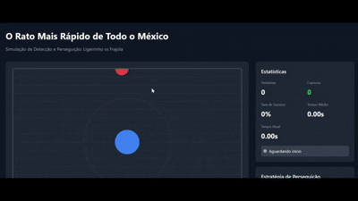

# O Rato Mais Rápido de Todo o México

## Simulação de Detecção e Perseguição entre Agentes Dinâmicos em Ambiente 2D

### Descrição do Projeto

Simulação computacional que modela a interação entre dois agentes animados em um plano bidimensional:
- **Ligeirinho** (Alvo): Agente rápido que cruza o canvas em trajetórias lineares
- **Frajola** (Perseguidor): Agente que detecta e intercepta o alvo usando diferentes estratégias



---

## Como Executar

### Opção 1: Abrir Diretamente no Navegador
1. Clone o repositório
2. Abra o arquivo `index.html` em um navegador moderno
3. A simulação iniciará automaticamente

### Opção 2: Servidor Local
```bash
# Usando Python 3
python -m http.server 8000

# Usando Node.js (http-server)
npx http-server

# Acesse http://localhost:8000
```

---

## Funcionalidades

### Controles
- **Play/Pause**: Inicia ou pausa a simulação
- **Reset**: Reinicia a simulação e estatísticas
- **Configurar**: Abre painel de ajustes
- **Exportar Dados**: Salva estatísticas em JSON/CSV

### Configurações Ajustáveis
- **Velocidade do Ligeirinho**: 5-20 px/frame
- **Velocidade do Frajola**: 3-15 px/frame
- **Sensibilidade de Detecção**: 30-150%
- **Taxa de Atualização**: 30-120 FPS

### Estratégias de Perseguição

#### 1. Perseguição Direta
- Move-se diretamente ao alvo

#### 2. Perseguição Preditiva
- Prevê posição futura do alvo

#### 3. Patrulha + Perseguição
- Patrulha quando não detecta

---

## Estatísticas Coletadas

A simulação rastreia:
- Número de tentativas
- Número de capturas
- Taxa de sucesso (%)
- Tempo médio de captura
- Tempo de cada tentativa
- Status de detecção

---

## Requisitos Técnicos

### Navegadores Suportados
- Chrome/Edge 90+
- Firefox 88+
- Safari 14+
- Opera 76+

### Tecnologias Utilizadas
- HTML5 Canvas
- JavaScript ES6+
- CSS3 (Grid, Flexbox, Animations)

---

## Metodologia

### Sistema de Detecção
O Frajola detecta o Ligeirinho baseado em:
- Raio de detecção configurável
- Sensibilidade ajustável
- Cálculo de distância em tempo real

### Motor de Física
- Movimentação baseada em vetores
- Atualização por frame
- Limitação de velocidade máxima
- Detecção de colisão circular

### Estratégias de IA
Cada estratégia implementa lógica específica:
- **Direta**: Perseguição simples por vetor
- **Preditiva**: Cálculo de interceptação
- **Patrulha**: Máquina de estados

---

## Referências

- Algoritmos de Perseguição: Reynolds, C. W. (1999). Steering Behaviors
- Detecção de Movimento: Background Subtraction Methods
- Física 2D: Game Programming Patterns

---

## Equipe

@aryMello

---

**Divirta-se explorando a perseguição mais rápida do México!**
